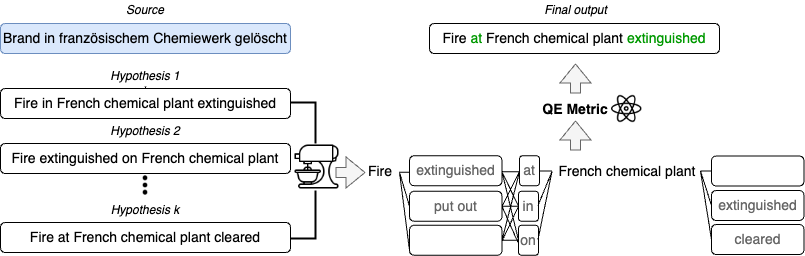

# QE-fusion

> [**Don't Rank, Combine! Combining Machine Translation Hypotheses Using Quality Estimation**](https://arxiv.org/abs/2401.06688)  
> Giorgos Vernikos, Andrei Popescu-Belis

## Overview

<p align="center">
  
</p>

## Installation

This project requires `Python 3.10`, `PyTorch 1.13.1`, and transformers `4.34.0`.

It's advisable to set up a separate environment for this project and install the necessary dependencies:

```
conda create -n qe-fusion python=3.10
conda activate qe-fusion
pip install -r requirements.txt
```
